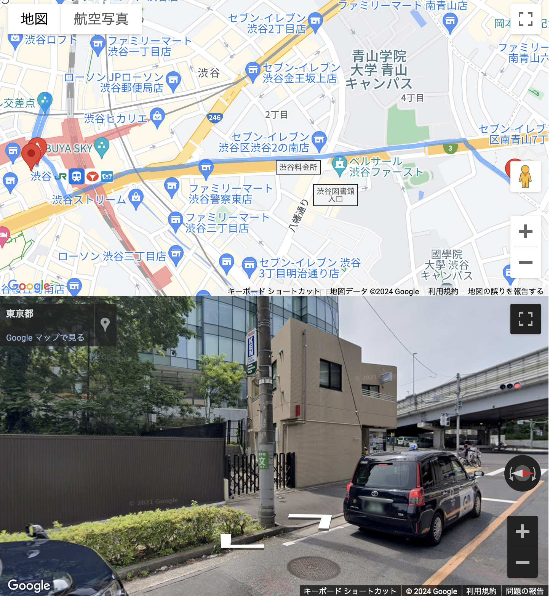

# Google street view movie for the shortest path 
This code provides a feature that uses Google Street View to display street views at 10 points along a specified route, one second at a time. It is perfect for those who want to preview the route before visiting a complex city for the first time. I personally find it very useful as I often get lost in unfamiliar places.

Features

	•	Specify start and end points with the mouse
 
	•	Display the route between the specified points
 
	•	Show street views at 10 points along the route, one second at a time

When two points (start point and goal point) are specified with the mouse,
the route to the start point and the goal point will be displayed below the map.
The street view of the 10 points along the route is displayed in order, one second at a time.

[How to use]
	

Assign your Google Map API key to YOUR_API_KEY and open 'maps.html'.
YOUR_API_KEY is in maps.html:
`src="https://maps.googleapis.com/maps/api/js?key=YOUR_API_KEY&callback=initMap&v=weekly&solution_channel=GMP_CCS_complexmarkers_v1"`

1. Open the maps.html file and replace YOUR_API_KEY with your Google Map API key.
    `
    `

2. Open maps.html in your browser.
3.	Use the mouse to specify the start and end points on the map.
4.	The route between the specified points will be displayed below the map.
5.	Street views at 10 points along the route will be shown one second at a time.

(This code is a temporary version made in a day and will be improved for a better user experience.)

For Walking

https://github.com/mm1129/Public_repo/assets/89204774/77d23ac8-a175-4a82-b2bd-011ee014a6db

For Driving
  

https://github.com/mm1129/Public_repo/assets/89204774/3cd595e9-d831-4235-997c-516eb03a8204

マウスで２地点（start地点、goal地点）を指定すると
そこまでの経路が表示されるとともに
下に経路間の10地点のストリートビューが1秒ずつ順に表示される。
[使い方]
Google MapのAPIキーをYOUR_API_KEYに代入しmaps.htmlを開く
  
  
