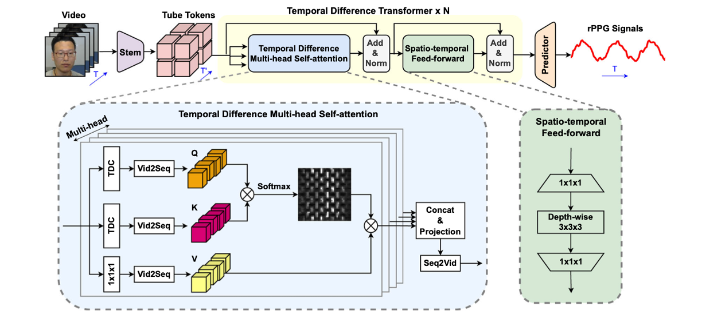

# Re-implementation of PhysFormer: Facial Video-based Physiological Measurement with Temporal Difference Transformer

This is a work for visual-media homework, and there is a possiblity to include some mistakes in coding.

[1]
@inproceedings{yu2021physformer,
        title={PhysFormer: Facial Video-based Physiological Measurement with Temporal Difference Transformer},
        author={Yu, Zitong and Shen, Yuming and Shi, Jingang and Zhao, Hengshuang and Torr, Philip and Zhao, Guoying},
        booktitle={CVPR},
        year={2022}
      }
      
      @article{yu2023physformer++,
       title={PhysFormer++: Facial Video-based Physiological Measurement with SlowFast Temporal Difference Transformer},
       author={Yu, Zitong and Shen, Yuming and Shi, Jingang and Zhao, Hengshuang and Cui, Yawen and Zhang, Jiehua and Torr, Philip and Zhao, Guoying},
       journal={International Journal of Computer Vision (IJCV)},
       pages={1--24},
       year={2023}
     }
- init部分は公式コードを参照しつつ実装
- それ以外はコアとして論文から実装

[PhysFormer: Facial Video-based Physiological Measurement with Temporal Difference Transformer](https://arxiv.org/abs/2203.14122)

[Why is this paper important]
I chose this paper because the merits of rPPG are significant:
1. Remote monitoring allows patients to be observed without physical attachments or invasive procedures.
2. Facial video-based measurements can detect stress levels, anxiety, and emotional states, which can be useful for both healthcare and human-computer interaction applications like virtual reality or gaming.
3. The future of remote healthcare and monitoring looks promising with the integration of these technologies.

The innovation of this paper is that it utilizes temporal difference features to enhance end-to-end video-based physiological signal measurement, leading to higher accuracy.
Recent deep learning approaches focus on extracting subtle cues in rPPG using convolutional neural networks with limited spatial and temporal receptive fields, but overlook long-range spatial and temporal perception and interaction for rPPG modelling. In this paper, local and global spatial and temporal features are adaptively aggregated to enhance rPPG representation[1] and this is why this paper is important.

[What I have implemented]
I implemented the overall architecture of PhysFormer, which is a transformer-based model for physiological measurement from facial videos. 
The model is trained to predict the physiological signals from the facial videos. 
1. Stem: 3 convolutional blocks
2. Tube tokenizer: divide into tube tokens
3. Temporal Difference Transformer Blocks:
    Temporal difference convolution(TDC)
    Multi-head attention
    Depth-wise 3D convolution
4. rPPG Predictor Head

Each description is as follows.
```
1. Shallow Stem: The shallow stem is the first stage of the PhysFormer architecture. It consists of three convolutional blocks that extract coarse local spatio-temporal features from the input video frames. (Each block includes batch normalization, ReLU activation, and max pooling layers, which help in speeding up the convergence and providing clear subsequent global self-attention.)
2. Tube Tokenizer: After the stem, the extracted features are divided into non-overlapping tube tokens by the tube tokenizer. This step (aggregates the spatio-temporal neighborhood semantics and) reduces the computational load for the subsequent transformer blocks.
3. Temporal Difference Transformer Blocks: The core of PhysFormer lies in its multiple temporal difference transformer blocks and each block consists of two modules. First is a Temporal Difference Multi-head Self-attention module and enhances the global spatio-temporal representation by capturing fine-grained local temporal difference features using temporal difference convolution (TDC). TDC emphasizes temporal features by subtracting start and end weights from normal weights when convolution. The latter Spatio-temporal Feed-forward module refines local inconsistencies and noisy features using depth-wise 3D convolution, which provides richer locality information.
4. rPPG Predictor Head: Finally, the rPPG predictor head processes the refined features to generate 1D rPPG signals. It temporally upsamples, spatially averages, and projects the features obtained from the transformer blocks to generate the final rPPG signals.
```
 
