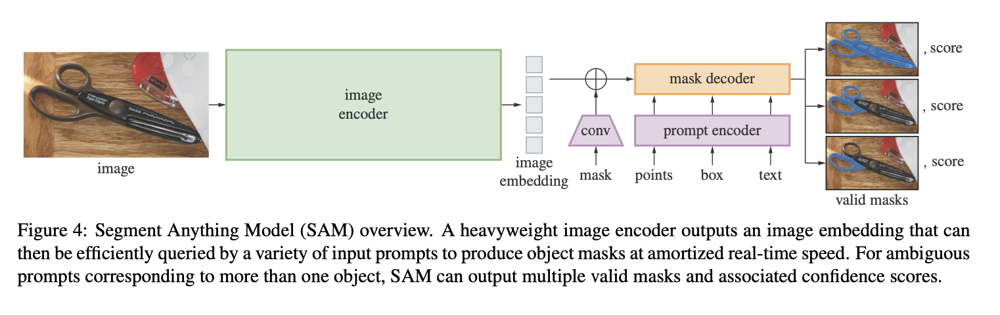
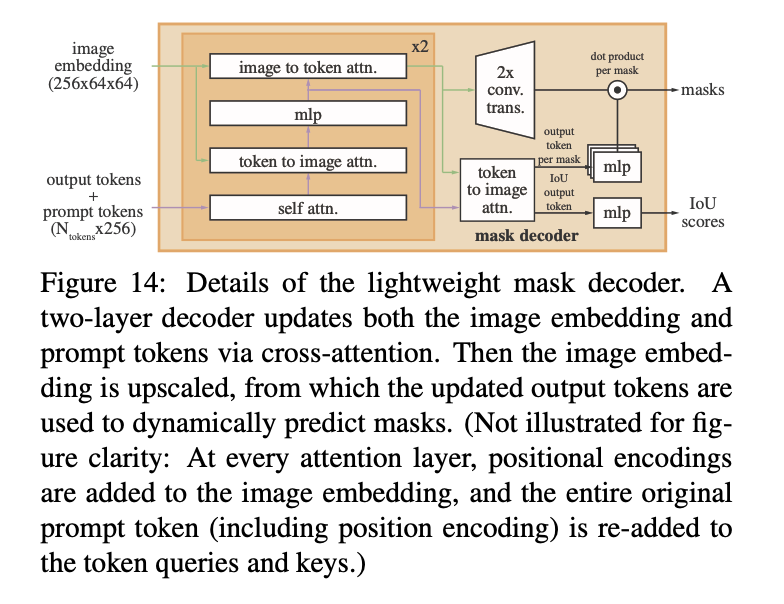
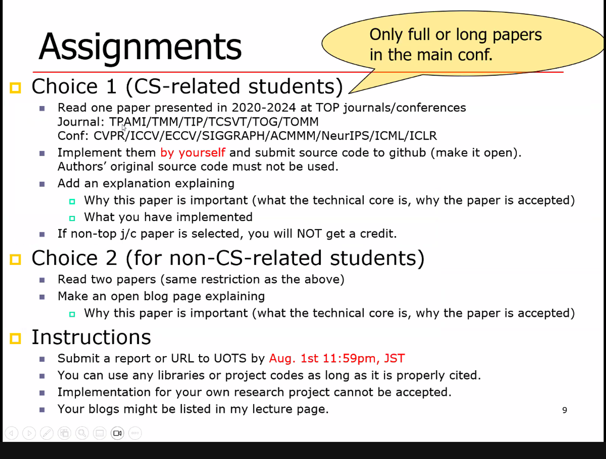

My Re-implemnted SAM by reading the paper
Segment Anything [ICCV, 2023]

For re-implementation, I reffered not only the content but also appendix.
The implementation part was mainly the overall arghitecture shown in figure 4, and the detailed model 

This work was done for the assignment below.

[why this paper is important]
The paper “Segment Anything” presents a significant advancement in the field of computer vision, particularly in the area of image segmentation. This research is important for several reasons. Firstly, it introduces the Segment Anything Model (SAM), a foundational model for image segmentation capable of generalizing to a wide range of tasks and data distributions beyond those seen during training. The SAM achieves this through the innovative concept of “promptable segmentation,” where the model can generate a valid segmentation mask given any form of prompt, such as points, boxes, masks, or even free-form text.
[what I heve implemented]
(Hints)
architecture
Initialisation (__init__ method):.

Initialises the three main components: image_encoder, prompt_encoder and mask_decoder.
Buffers the mean (pixel_mean) and standard deviation (pixel_std) used to normalise the input image.
Forward propagation (forward method).

Receives batch input, preprocesses and encodes the image.
Encodes prompts such as points, boxes and masks from the encoded image.
Generate low-resolution masks and IoU predictions using a mask decoder.
Postprocesses the mask to the original image size and returns the result in a list.
Post-processing of masks (postprocess_masks method):.

Resizes a low-resolution mask to the original image size and removes padding.
Pre-processing (preprocess_masks method):.

Normalises the image and converts it to a square input, adding padding if necessary.